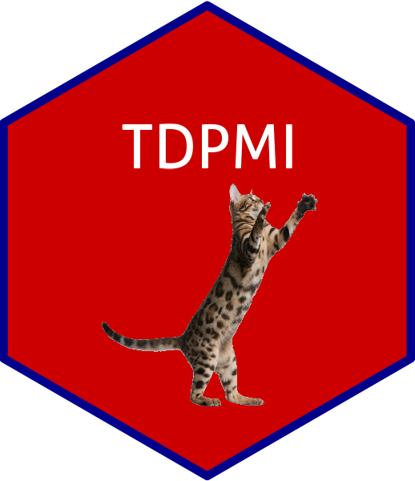

# TDPMI 

 


The goal of TDPMI is for time-dependent progression-related gene set enrichment analysis of myocardial infarction base on msigdbr, dplyr, stringr, ggplot2, enrichplot, clusterProfiler package. 

The **mfuzz** package was used to cluster all the genes of each cell subgroup in myocardial infarction according to the time trend, thereby obtaining different gene modules and organizing them into a gene set annotation database. Subsequently, each gene module in the annotation database was enriched using specific gene list.

**You can enter a list of genes for time-dependent progression-related gene set enrichment analysis of myocardial infarction.**


## Installation

You can install the TDPMI from [GitHub](https://github.com/) with:

``` r
# install.packages("devtools")
devtools::install_github("mumdark/TDPMI")
```

## Examples

You can use the code below to execute the example:

``` r
library("TDPMI")
result <- TDPMIenrich(genes=c("Aqp1","Cxcl3","Gm26870","Hba-a1","Hba-a2","Hbb-bs","Hbb-bt","Mb","mt-Atp6","mt-Atp8","mt-Co1","mt-Co2"),
                                  organism = "mmu",
                                  useFilter="TRUE",
                                  pvalueFilter=0.05,
                                  qvalueFilter=0.05,
                                  highcol="grey",
                                  lowcol="red3",
                                  typefigure="bubble")
```

</img>

## Arguments

**genes**: a vector of a list of genes

**pvalueFilter**: pvalue filter for enrichment

**qvalueFilter**: qvalue filter for enrichment

**highcol**: color for high statistical significance

**lowcol**: color for low statistical significance

**useFilter**: Whether to filter the results based on the pvalue and qvalue

**typefigure**: The type of the output figure, including "barplot", "bubble" and "all"

**organism**: the organism of input genes (using "hsa" or "mmu")

## Citation

> mumdark Liu (2023). *TDPMI: For time-dependent progression-related gene set enrichment analysis of myocardial infarction.*  https://github.com/mumdark/TDPMI

